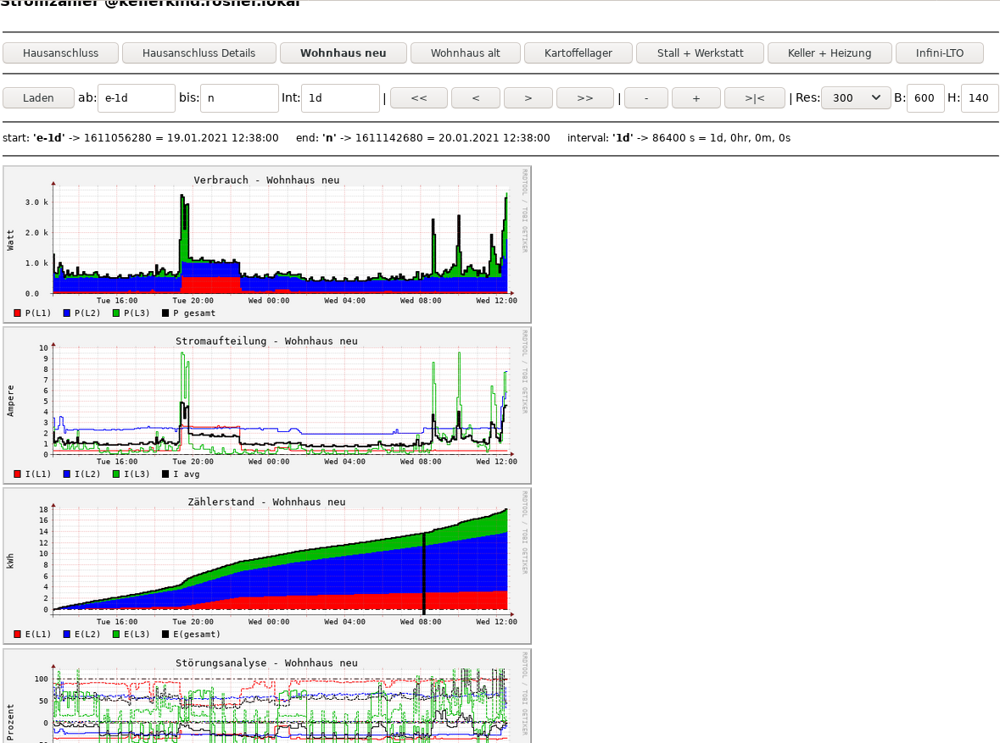

This PERL CGI provides a kind of **'dashboard' style navigation** through a set of predefined **plot views of rrd round robin loging database** sets.  
It's all pure PERL to keep it at maximum flexibility.  
It's intended to serve as a boilerplate for other projects as well.  

## Screenshot




## Elements

Implementation is pure server side CGI, no JavaScript required.  
All state management ist provided by http POST variables.  
Only debugging can be activated by url included GET variable.  

### Selector
The buttons list at the top row is generated by configured view  list and allow switching between a 
list of views. Current view is marked bold.  
Preselected time setting is preserved.  
URL preselection by adding `?select=viewtag` may be used by external links.  
May work for other variables as well, but not tested. rtfS if in doubt.    

### Navigator
The second row of buttons and input fields allow to browse visible plots through time domain.  

#### Time scroll buttons
The `<< < > >>` buttons allow jumps by half / full amount of the intervals currently active.  
`+ -` allow zooming in / out by halfing / doubling the interval, keeping the center.  
`>|<`resets everything (interval, selection, format) to default.

#### Manual timing
... can be  typed into the field No 2...4.  
After some exercise, I prefer navigation by typing intervals over the buttons.  
It is faster and more precise.  
  
Sorry for the German labels. 'ab:' ist for **start**, 'bis:' is for **end**, 'Int' is for **interval**.  
Two out of 3 values ar required to define the plotted time range.  
If underdefined, defaults are filled in (`e-1d` and `n` - display the recent 24 hrs).  
If overdefined, 'Int' is ignored and 'ab' / 'bis' are evaluated.  

Time strings are interpreted by rrdtool. Thus, their
[AT-style time specification](https://oss.oetiker.ch/rrdtool/doc/rrdfetch.en.html#AT-STYLE_TIME_SPECIFICATION)
applies.  
'n' is for now, 's' is for start, 'e' is for end. Circular reference and other errors are reported.  
'd' = day, 'h' = hour, 's' (or pure numbers) is for seconds, 'min' = minutes, 'm'=monts (sorry....).   
Play and learn quickly.   

### time bar and time zones
rrdtool internally works with unix time stamps.  
Time zone and time format is applied at the input / output interface.  
The time bar below the time scroll bar displays all three time elements in
* the time tag as entered
* unixtime, i.e seconds since 'the epoc'
* human readable local time (time zon according to current locale)

It' intention is to serve as a source to copy time and/or modify for input in the fields.  
Beware: fields are shorter than time string, be sure to avoid invisible rest sent to the script.  
Play and learn quickly.  

### Graphs
Should be visible below in the way and style configured.  
Accessible by their url in the tmp dir , as long as not overwritten by another call of the scripts.  
Graphs are only redrawn by the CGI, not by retrieving them at their tmp url.


### Limitation
This setup is not thread safe.  
If two clients call the script with same selection, but different times, within a fraction of a second,  
plots may overwrite each other.  
In a high frequent environemnt, we might attach some unique element to the img name (e.g. microsecond time) to keep them unique.  
However, this way the tmp file would clobber, and we had to provide for cleanup.  


# Code "management"
The rrd CGI web rendering engine is boilerplated from a script I am using in other projects as well, e.g.
 https://github.com/wolfgangr/guntaPERL

It's furter extended here, so may be a good time to keep notes of the structure.

## Rationale

Basic rrd rendering is possible using `rrdtool graph` or its wrapper libraries and static definitions.
But this is not appropriate for quick data browsing via a Web browser.

For experimenting, development and special evaluations I use drraw  
http://web.taranis.org/drraw/ .
It apperas quite old and not maintained any mor, but does the job.  
I surveyd cacti but this appears to bloated for my purpose.
I want the full leverage of a turing capable language, with as little overhead as possible.

So for this project I pulled the graph templating out of the CGI and implemted it in pure perl scripting.


# code structure

### `SDMcounters.pl` is the CGI to be called in the browser.  
It must be configured as PERL executable CGI.  
`./render/tmp` must be writable by the web server. Write acces for group `www-data` does the job for my lighttpd on debian.  

* read in the config
* prepare the 
[$navigator](https://github.com/wolfgangr/SDM2rrd/blob/f9ea9867b716cba20de17324005be73ec14dc6a6/render/SDMcounters.pl#L62)
to change between the different views as configured
* maintain state for `debug` and `select` in [hidden input fields](https://github.com/wolfgangr/SDM2rrd/blob/f9ea9867b716cba20de17324005be73ec14dc6a6/render/SDMcounters.pl#L77)
* [default processing](https://github.com/wolfgangr/SDM2rrd/blob/f9ea9867b716cba20de17324005be73ec14dc6a6/render/SDMcounters.pl#L101) for time browsing
* evaluate the time domain [navigation buttons](https://github.com/wolfgangr/SDM2rrd/blob/f9ea9867b716cba20de17324005be73ec14dc6a6/render/SDMcounters.pl#L173)
* create the [plot images](https://github.com/wolfgangr/SDM2rrd/blob/f9ea9867b716cba20de17324005be73ec14dc6a6/render/SDMcounters.pl#L215) 
for all graphs in the current screen aka `@targets`
by feeding rdgraph` commands to `RRDs` libray and keep them in `tmp` with a name distinguished by `$target`.  
* render the [HTML page](https://github.com/wolfgangr/SDM2rrd/blob/f9ea9867b716cba20de17324005be73ec14dc6a6/render/SDMcounters.pl#L256) 
comprised of
  * proper heading
  * a table containing a [<form>](https://github.com/wolfgangr/SDM2rrd/blob/f9ea9867b716cba20de17324005be73ec14dc6a6/render/SDMcounters.pl#L263)
    to implement the navigor functionality
  * [ tags ](https://github.com/wolfgangr/SDM2rrd/blob/f9ea9867b716cba20de17324005be73ec14dc6a6/render/SDMcounters.pl#L332)
    for our previously generated plots
  
Some debug code is still in place but jumped over - just in case to reuse it as boilerplate for the next project...  
Some of the subs after `exit` are necessare, most are left over from debugging and earlier boilering. 


###`counterlist.dat` 
To limit CGI start overhead, I kept the counter config distinct from the rest of the project.  
Call `./extract-counter-def.pl` to write `%counterlist` using PERL `Serialize` module to `./render/counterlist.dat`
whenever change in the main config shall be known to the renderer.

### `counter_graphs.pm`
This is where the graphical definitions go.  
It produces `rrdgraph` command sequence bodies as described here:
* [rrdgraph] (https://oss.oetiker.ch/rrdtool/doc/rrdgraph.en.html)
* [rrdgraph_graph] (https://oss.oetiker.ch/rrdtool/doc/rrdgraph_graph.en.html)
* [rrdgraph_rpn] (https://oss.oetiker.ch/rrdtool/doc/rrdgraph_rpn.en.html)

They are included by `my @tail = graph_spec ($selected, $target);` in 
[SDMcounters.pl](https://github.com/wolfgangr/SDM2rrd/blob/f9ea9867b716cba20de17324005be73ec14dc6a6/render/SDMcounters.pl#L236)  
The caller then add start, stop time and some other params from the navigator.  
Last one wins, so we can overwrite navigator settings. I do this sometimes with `height`, maybe `step` could be a candidate.  
Mangling with times or `width` would but break the consistence of navigation in time.

When we turn on debug, we see the definitions such as
```
$VAR1 = [
          './tmp/flow.png',
          '--start',
          '1611051249',
          '--end',
          '1611137649',
          '--imgformat=PNG',
          '--interlaced',
          '--title=Dummy 1',
          '--vertical-label=foo bar',
          'LINE1:0#000000::dashes=1,4,5,4',
          'LINE3:1#FF0000::dashes=3,3'
        ];
$VAR2 = 'mains';
$VAR3 = 'flow';
```
at the top of the rendered page in the browser.  
`$VAR1` is the template we created (in the example starting with `--title...)` we created plus the leaders added by the navigator (top 6 lines until `--interlaced`.

`mains` and `flow` are the parameters with which 
[sub graph_spec {](https://github.com/wolfgangr/SDM2rrd/blob/f9ea9867b716cba20de17324005be73ec14dc6a6/render/counter_graphs.pm#L60)
was called.

So we can evalute those parameters and produce the graphing to our needs.
I organized it into distinct subroutines which I just keep boilerplate-copying over again and again.

Maybe some modularisation were possible. Quite sure about that....     

`rrdg_lines_ary` is a debug ileftover to reuse templates form drraw, shell scripts and other sources.  
It takes a string of commands, seperated by lines, strips leading and trailing spaces as well as bash style `\`-newline-escapers
and returns them as array, suitable to be bassed back.  
And it may serve as example for ugly but efficient PERL code ;-)  


# configuration

Basic customization (title, time format) resides in the head of `SDMcounters.pl`.  
Anything else is provided by `counterlist.dat`.  
It reads 
[%counterlist](https://github.com/wolfgangr/SDM2rrd/blob/f9ea9867b716cba20de17324005be73ec14dc6a6/render/counter_graphs.pm#L15)
 and derives rendering structure from it.  
This way we may build the dashbhoard structure.  
When debug is on, we see the result of this process:

```
$VAR1 = {
          'subs1' => [
                       'power',
                       'basics',
                       'energy',
                       'quality'
                     ],
          'subs2' => $VAR1->{'subs1'},
          'mains' => [
                       'm_stacked',
                       'm_lined',
                       'flow',
                       'energy'
                     ],
          'mains_d' => $VAR1->{'subs1'},
          'subs3' => $VAR1->{'subs1'},
          'subs5' => $VAR1->{'subs1'},
          'subs6' => $VAR1->{'subs1'},
          'subs4' => $VAR1->{'subs1'}
        };
$VAR2 = [
          'm_stacked',
          'm_lined',
          'flow',
          'energy'
        ];
```
The hash keys of `$VAR1` aka `\%target_h` comprise the different view we can select with the buttons in the selection line.  
The value arrays provide the tags for the list of charts that are displayed by each view.
`$VAR2` aka `\@targets` is the list for the current selection.  
This way we hand over the possible selections to the navigator CGI, which is calling back ($counter, $template) tuples
to aks for expanding the graphing commands.

`my %counter_default_colors ` is used just locally to keep a consistent colouring between different plots and views.  
They are not referred by outside code.


## Screenshot


## Elements

Selector

Navigator

Graphs

## Debug

for the graph definitions can be turned on by setting GET varable `debug` to anything perlie true:  
`http://our.server.ip/pl_cgi/counter_render/SDMcounters.pl?debug=1`  

rdgraph errors are always displayed, independent of the setting.

Loads of debug clauses reside still just uncommented in the source. 

## optional extra frames

are handy to include other elements in the "dashboard" than rrd plots without too much code clobbering.  
Not used here, but see for example my
[Guntamatic](https://github.com/wolfgangr/guntaPERL/blob/7704f3b84a03fa7a452f98aeb281109c67c41a68/render/guntamatic.pl#L322) 
project.  
There I include a html state view and a log file grep.  

## optional extra event vlines

maybe also included here once.  
possible template:
[configuration] (https://github.com/wolfgangr/guntaPERL/blob/7704f3b84a03fa7a452f98aeb281109c67c41a68/render/guntamatic.pl#L22)  
Feed the time as to displayed by the [dashboard CGI ] (https://github.com/wolfgangr/guntaPERL/blob/7704f3b84a03fa7a452f98aeb281109c67c41a68/render/guntamatic.pl#L150)
to the loggrepper, which returns a list of times. Convert this after some mangling to rrdgraph `VLINE` definitions and keep them in `@event_vrule_defs`

Feed them to the [rrdgraph templates](https://github.com/wolfgangr/guntaPERL/blob/7704f3b84a03fa7a452f98aeb281109c67c41a68/render/guntamatic.pl#L221)
at the time of chart generation.


